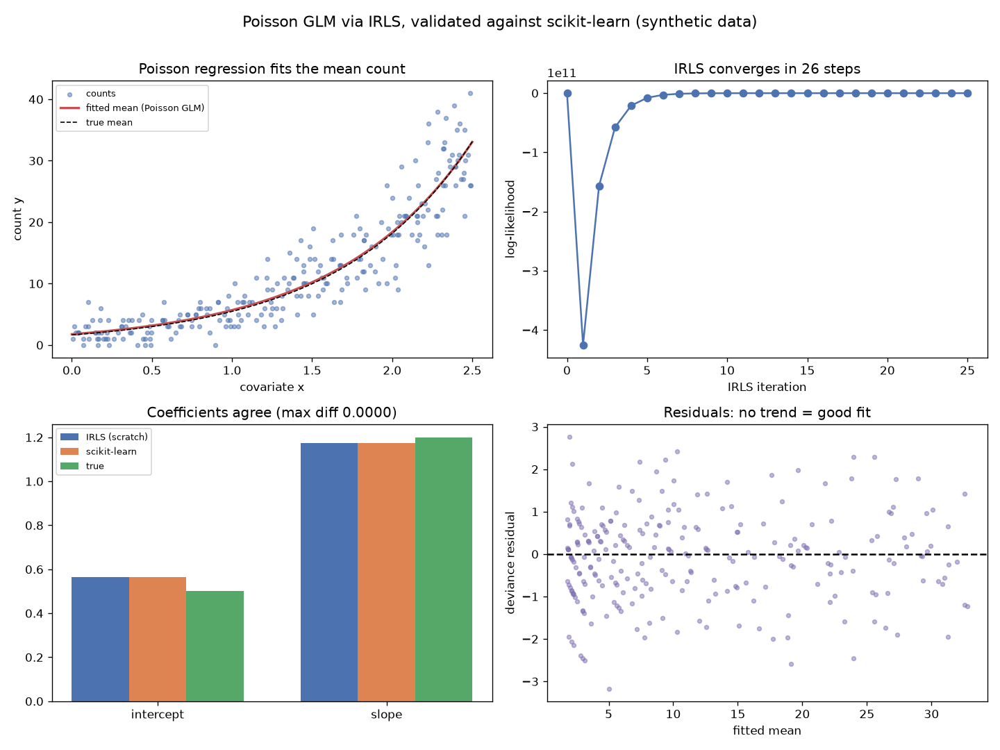

# Poisson GLM via IRLS

Fitting a straight line to count data — read counts, mutation counts, cell counts — is a quiet, common mistake. Counts are non-negative, integer, and have variance that grows with the mean, none of which ordinary linear regression respects. The Poisson generalized linear model is the right tool, and this project fits one from scratch using the algorithm every GLM solver actually runs: Iteratively Reweighted Least Squares.

## Demo Output



Produced entirely from synthetic count data by `demo.py` — no downloads. The from-scratch fit matches scikit-learn to five decimal places.

## Why This Exists

Generalized linear models extend linear regression to non-Gaussian outcomes by pairing a distribution (here Poisson) with a link function (here log). The log link means the model predicts `log(mean count) = intercept + slope·x`, so effects are multiplicative on the count scale — a one-unit change in x multiplies the expected count by a constant. There is no closed-form solution, but there is a beautiful iterative one. IRLS repeatedly forms a *working response* and *weights* from the current fit, then solves an ordinary weighted least-squares problem — and this loop is exactly Fisher scoring, provably converging to the maximum-likelihood estimate. Understanding it demystifies logistic regression, Poisson regression, and the negative-binomial models at the heart of DESeq2 and edgeR, which are all the same algorithm with different distributions.

## How It Works

1. **Working response & weights.** From the current linear predictor, compute the mean, the weights (equal to the mean for Poisson), and a linearised working response.
2. **Weighted least squares.** Solve the weighted normal equations for updated coefficients.
3. **Iterate** until the coefficients stop moving — typically a handful of steps.

The demo shows four things:

1. **The fit** — counts against the covariate with the fitted (exponential) mean curve tracking the true one.
2. **Convergence** — the log-likelihood climbing to its maximum in just a few IRLS iterations.
3. **Validation** — the from-scratch coefficients set against scikit-learn's and the true values; they coincide.
4. **Deviance residuals** — the GLM's proper residuals plotted against the fitted mean; a trendless cloud means the model fits.

## When NOT to Use This

The Poisson model assumes the variance equals the mean. Real count data are almost always *overdispersed* — variance exceeds the mean — and forcing Poisson on them gives standard errors that are too small and false positives (which is exactly why RNA-seq tools use the negative binomial instead; see the companion project). Poisson is right for genuinely equidispersed counts and as the base case; check for overdispersion before trusting its p-values.

## The Uncomfortable Truth

Linear regression will happily run on count data and hand you a tidy slope and a p-value. They are wrong — the model predicts negative counts, mis-estimates uncertainty, and violates its own assumptions. The mistake is invisible in the output and obvious in the residuals. Choosing the distribution that matches your data is not pedantry; it is the difference between a valid inference and a plausible-looking artefact.

## Run It

```bash
pip install -r requirements.txt
python demo.py
```

`poisson_glm.py` provides `fit_irls`, `predict`, and `deviance_residuals`.

## Further Reading

Inspired by the generalized-linear-model chapters of *Data Analysis for the Life Sciences* (Irizarry & Love) and *Modern Statistics for Modern Biology* (Holmes & Huber, https://www.huber.embl.de/msmb/).

> Demonstrated on synthetic data, so the whole thing is reproducible with no external downloads.
